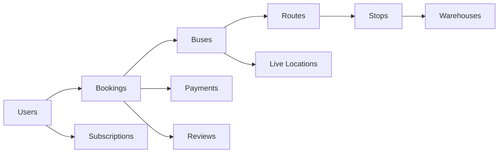

# Database Schema

## Collections

### `users`

- `_id`
- `name`
- `phone`
- `email`
- `role`
- `rating`
- `createdAt`

App-specific extensions currently used by the API:

- `badgeNumber`
- `status`
- `usage`
- `language`
- `walletBalance`
- `gstNumber`

### `buses`

- `_id`
- `busNumber`
- `driverId`
- `capacityTotal`
- `capacityAvailable`
- `routeId`
- `currentLocation`
- `status`

Operational extensions currently used by the driver flow:

- `currentStopId`
- `nextStopId`
- `startedAt`
- `completedAt`

### `routes`

- `_id`
- `routeName`
- `startLocation`
- `endLocation`
- `stopIds`
- `distance`
- `basePrice`

Route metadata retained for the existing apps:

- `perKmFare`
- `code`
- `slots`

### `stops`

- `_id`
- `name`
- `location`
- `order`
- `routeId`

### `bookings`

- `_id`
- `userId`
- `busId`
- `routeId`
- `pickupStopId`
- `dropStopId`
- `weight`
- `price`
- `status`
- `createdAt`

Booking metadata retained for current app screens:

- `quantity`
- `packageType`
- `fragile`
- `express`
- `paymentMethod`
- `slotId`
- `tracking`

### `payments`

- `_id`
- `bookingId`
- `userId`
- `amount`
- `method`
- `status`
- `transactionId`

### `reviews`

- `_id`
- `bookingId`
- `reviewerId`
- `targetId`
- `rating`
- `comment`

### `live_locations`

- `_id`
- `busId`
- `lat`
- `lng`
- `speed`
- `updatedAt`

### `warehouses`

- `_id`
- `stopId`
- `capacity`
- `currentLoad`

### `subscriptions`

- `_id`
- `userId`
- `routeId`
- `validFrom`
- `validTo`
- `type`

### Auth Support Collections

- `otp_sessions`
- `auth_sessions`
