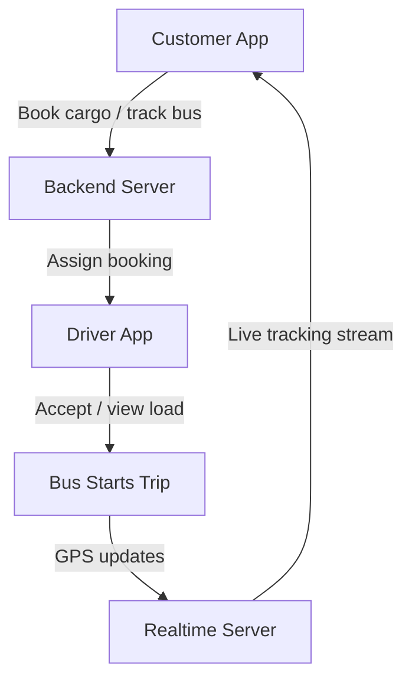
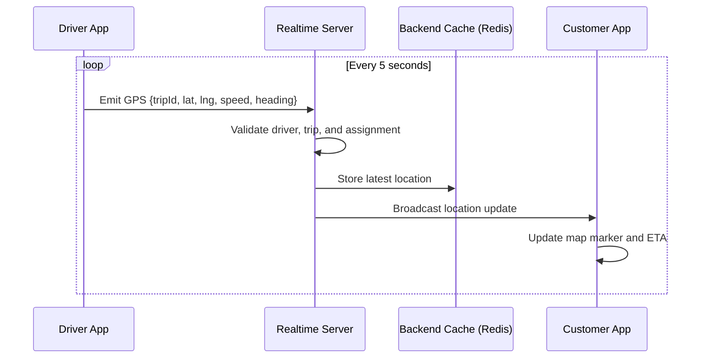
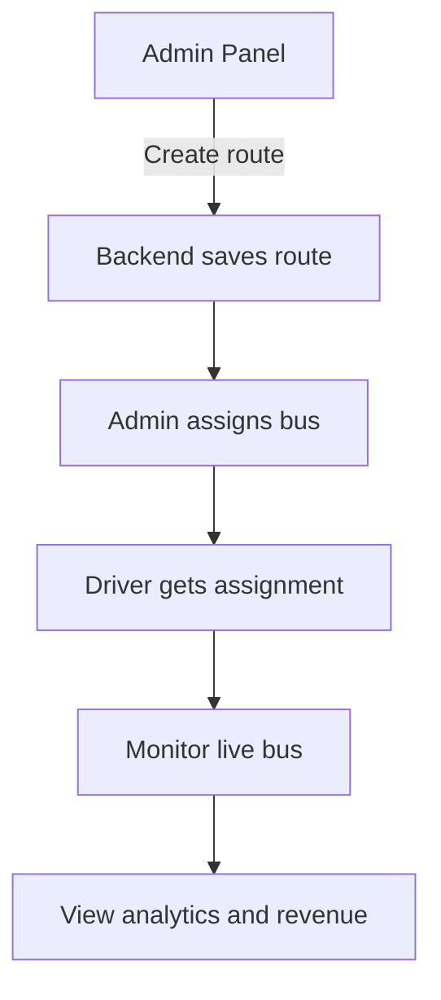

# Bus Logistics Ecosystem

This document defines how the customer app, driver app, backend, realtime layer, and admin web panel work together.

## 1. Customer + Driver Combined Ecosystem Flow

### Core Rule

- The customer app does not talk directly to the driver app.
- The backend owns booking, assignment, permissions, and delivery state.
- The realtime layer only carries location and trip events after backend authorization.

## 2. Realtime Tracking Technical Sequence

### Realtime Notes

- GPS should be sent from the driver app every 5 seconds during an active trip.
- The server should reject updates from unassigned drivers or closed trips.
- Redis should hold the latest trip position and short event history.
- Customer clients should subscribe by trip ID or booking ID.
- Customer UI should consume server-approved updates only.

## 3. Admin Control Workflow

### Admin Responsibilities

- Create and manage routes
- Create and manage buses
- Create and manage drivers
- Assign routes and buses to drivers
- Monitor bookings and active trips
- Review revenue, trip counts, utilization, and reports

## 4. Delivery Boundaries

### Backend Owns

- Authentication and OTP
- Booking creation and booking status
- Route definitions and stop sequences
- Driver assignment and trip authorization
- Fare calculation
- Booking-to-trip mapping
- Trip lifecycle state

### Driver App Owns

- Driver login
- Assigned bus and route visibility
- Active trip controls
- GPS publishing
- Stop handling
- QR scan / boarding / cargo operations

### Customer App Owns

- Booking flow
- Fare quote flow
- Booking history
- Live tracking consumption
- Delivery status visibility

### Realtime Layer Owns

- Fast transport of GPS updates and trip events
- Subscription fan-out to customer clients and admin panel
- Presence and connection state

